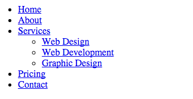
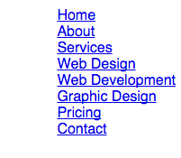
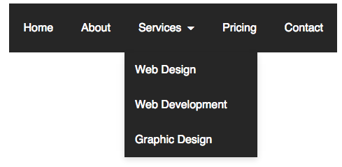
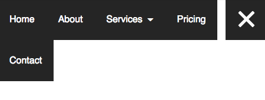
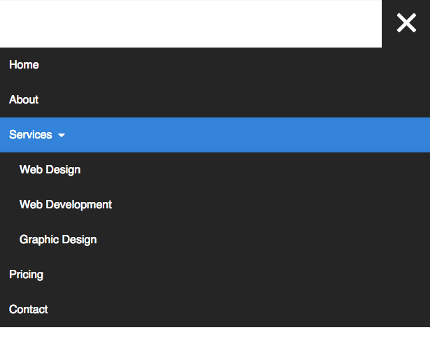

[Bootstrap](http://getbootstrap.com) and [Foundation](http://foundation.zurb.com) have fantastic navbars that you can use if you choose to base your layout on their framework. For my own projects, I chose to make a customizable responsive dropdown navbar with an animated hamburger menu. The navigation is built on [Sass](http://sass-lang.com), adaptable, and requires very little jQuery. It was inspired by [Flaunt.js](http://toddmotto.com/flaunt-js-for-stylish-responsive-navigations-with-nested-click-to-reveal/) by [Todd Motto](http://toddmotto.com/).

There's a lot that goes into building a navbar like this, so I'll go over the specifics. Frameworks are great, but I think it's a great idea for every developer to create their own navigation at some point to understand how it works.

## The Demo

See the Pen [Responsive Dropdown Navigation Bar](http://codepen.io/taniarascia/pen/dYvvYv/) by Tania ([@taniarascia](http://codepen.io/taniarascia)) on [CodePen](http://codepen.io).

I would suggest opening a new pen on [Codepen](http://codepen.io) and doing this tutorial step by step to see how it works.

## The HTML

Let's start with the menu itself. It's a regular list, wrapped in a semantic `nav` tag.

```html
<nav>
  <div class="nav-mobile">
    <a id="nav-toggle" href="#!"><span></span></a>
  </div>
  <ul class="nav-list">
    <li><a href="#!">Home</a></li>
    <li><a href="#!">About</a></li>
    <li>
      <a href="#!">Services</a>
      <ul class="nav-dropdown">
        <li><a href="#!">Web Design</a></li>
        <li><a href="#!">Web Development</a></li>
        <li><a href="#!">Graphic Design</a></li>
      </ul>
    </li>
    <li><a href="#!">Pricing</a></li>
    <li><a href="#!">Contact</a></li>
  </ul>
</nav>
```

A list with no styling applied. Everything in the `nav-mobile` class will not appear until we begin working on the small device view. Setting the links to `#!` will ensure that no action takes place on click.



## The SCSS

I like to use Sass, or more specifically, [SCSS.](http://thesassway.com/editorial/sass-vs-scss-which-syntax-is-better) There's a lot of nesting going on in these navbars, and we can prevent repetition in the code with Sass. Additionally, variables will drastically improve the ease of color and size customization.

First, I'm going to set a few variables.

```scss
$content-width: 1000px;
$breakpoint: 799px;
$nav-height: 70px;
$nav-background: #262626;
$nav-font-color: #ffffff;
$link-hover-color: #2581dc;
```

`$content-width` will be the max width of the content within the navigation bar. `$breakpoint` determines at which width the media query breakpoint will take effect. Obviously named variables are created for size and colors.

##### The Sass Skeleton

```scss
nav {
  ul {
    li {
      a {
        &:hover {
        }
        &:not(:only-child):after {
        }
      } // Dropdown list
      ul li {
        a {
        }
      }
    }
  }
}
```

Now we begin filling it in. We'll float the entire nav to the right, remove the bullet points on the list and any pre-determined browser padding.

```scss
nav {
  float: right;
  ul {
    list-style: none;
    margin: 0;
    padding: 0;
  }
}
```



Now we float the list items to the left and style the `a` tag. The `li` will be set to `position: relative`, which doesn't do anything yet, but will be explained a few steps down.

```scss
li {
  float: left;
  position: relative;
  a {
    display: block;
    padding: 0 20px;
    line-height: $nav-height;
    background: $nav-background;
    color: $nav-font-color;
    text-decoration: none;
  }
}
```


I've set the nested `a` tag to `display:block` with some padding, and gave it our previously determined colors. This is a dark navbar, but you can just as easily revert the colors for a light navbar.

```scss
a {
  &:hover {
    background: $link-hover-color;
    color: $nav-font-color;
  }
  &:not(:only-child):after {
  padding-left: 4px;
  content: ' ▾';
}
```

The hover is simple - I'm just changing the background color of the entire `a` tag. Next, we have some pretty interesting CSS3.

```css
&:not(:only-child):after
```

The full path of this code is `nav ul li a:not(:only-child):after`. This means that the code will apply to any `a` tag in our `nav` list that is NOT an only child, aka any dropdown. The `:after` means it comes after the output of the tag. I've decided that to specify any nav item as a dropdown, it will be followed by a unicode arrow - ▾ (#9662).


```scss
} // Dropdown list
  ul li {
    min-width: 190px;
    a {
      padding: 15px;
      line-height: 20px;
    }
```

A small bit of styling is applied to the nested `ul`s. I've given the `li` a minimum width, so that the dropdown width won't vary based on content. I've changed the padding and line-height of the dropdown `a`, because the styling cascades down from the parent.


### Positioning

Absolute and relative positioning remove items from the normal flow of the document. [Learn CSS Layout](http://learnlayout.com/position.html) has a very good, simple explanation of how positioning works. The important part to remember for this dropdown nav is that an `position:absolute` element will be placed relative to a `position: relative` element. You can think of the absolute element being nested within the relative element.

We already set the `li` to `position: relative` earlier. Now we're going to add a new, absolutely positioned class. `z-index: 1` guarantees that the dropdown will display on top of any content. And I added a box shadow, as is standard for dropdowns.

```css
.nav-dropdown {
  position: absolute;
  z-index: 1;
  box-shadow: 0 3px 12px rgba(0, 0, 0, 0.15);
}
```



Add `display: none;` so that we can toggle it later with JavaScript.


## The jQuery

We'll begin adding jQuery.

```js
;(function($) {
  // Begin jQuery
})(jQuery)
```

And tell the function to run on DOM ready.

```js
;(function($) {
  $(function() {
    // DOM Ready
    // Insert all scripts here
  })
})(jQuery)
```

Activating the dropdown is extremely simple. I devised this specific method, and haven't seen it used on any other dropdown nav, and seems to work quite well. I'm going to target any `a` in the menu that has children, and toggle the `.nav-dropdown` class.

```js
$('nav ul li > a:not(:only-child)').click(function(e) {
  $(this)
    .siblings('.nav-dropdown')
    .toggle()
})
```

1. When the CSS path `nav ul li > a:not(:only-child)` is clicked on...
2. Toggle (change the `display` property of) that specific `nav-dropdown` class.

`$(this)` specifies that it only targets only what was clicked on, and not _every_ instance of that CSS path.

But what's that `(e)` for? If you happen to have two dropdowns in the nav, and click on both of them, they both open. We want to prevent that behavior, and force only one dropdown to be open at a time. Inside of that same function, add:

```js
$('.nav-dropdown')
  .not($(this).siblings())
  .hide()
e.stopPropagation()
```

This hides all of the dropdowns, and `stopPropagation();` prevents that action from taking place. We attach it to `e` and place that `e` in the function.

There's one more thing: I want the dropdown to hide if I click away from it at any point. We'll hide it by setting a click function to the entire `html` tag.

```js
$('html').click(function() {
  $('.nav-dropdown').hide()
})
```

Here's the entire jQuery so far.

```js
;(function($) {
  $(function() {
    $('nav ul li > a:not(:only-child)').click(function(e) {
      $(this)
        .siblings('.nav-dropdown')
        .toggle()
      $('.nav-dropdown')
        .not($(this).siblings())
        .hide()
      e.stopPropagation()
    })
    $('html').click(function() {
      $('.nav-dropdown').hide()
    })
  })
})(jQuery)
```

## Mobile

Now we have a fully functional dropdown nav. The next step is to turn it into a "hamburger" menu on mobile collapse. We're going to create a square in the top right of the screen where the hamburger will live.

```scss
.nav-mobile {
  //display: none;
  position: absolute;
  top: 0;
  right: 0;
  background: $nav-background;
  height: $nav-height;
  width: $nav-height;
}
```

> `display:none` is commented out so we can work on it right now. Later I will refer back to this.

Create a media query based on the mobile breakpoint.

```scss
@media only screen and (max-width: $breakpoint) {
  // Insert all mobile styles here
}
```

For now, hide the `ul` and we'll work on the hamburger.

```scss
nav {
  ul {
    display: none;
  }
}
```

Elijah Manor created a great [CSS animated hamburger icon](http://codepen.io/elijahmanor/pen/Igpoe), and we're going to use that method. You can read his [tutorial](http://elijahmanor.com/css-animated-hamburger-icon/) to learn more about how this works. For my part, I condensed it for Sass.

The concept behind how it works is that a `span` class in the `#nav-toggle` id has a `:before` and an `:after`. The span is displayed as a thin, wide block level element that looks like a line. The before and after raise and lower the line, creating three lines.

Finally, the jQuery comes in and adds an `.active` class to the span, which rotates the `:before` and `:after`, creating an X.

```scss
#nav-toggle {
  position: absolute;
  left: 18px;
  top: 22px;
  cursor: pointer;
  padding: 10px 35px 16px 0px;
  span,
  span:before,
  span:after {
    cursor: pointer;
    border-radius: 1px;
    height: 5px;
    width: 35px;
    background: $nav-font-color;
    position: absolute;
    display: block;
    content: '';
    transition: all 300ms ease-in-out;
  }
  span:before {
    top: -10px;
  }
  span:after {
    bottom: -10px;
  }
  &.active span {
    background-color: transparent;
    &:before,
    &:after {
      top: 0;
    }
    &:before {
      transform: rotate(45deg);
    }
    &:after {
      transform: rotate(-45deg);
    }
  }
}
```

Toggle the `.active` span.

```js
$('#nav-toggle').on('click', function() {
  this.classList.toggle('active')
})
```

Now you have a hamburger icon that animates on click action, but doesn't do anything yet.


The final addition to our jQuery code will toggle the `nav ul` on click.

```js
$('#nav-toggle').click(function() {
  $('nav ul').toggle()
})
```



Perfect! The hamburger toggles the menu. Our jQuery functionality is complete.

### Fixing the disappearing navbar bug

I've seen many navbars that have a bug that causes the menu to disappear on desktop if you already toggled the view on mobile. This is an issue that is mostly noticed by developers, as your average user probably isn't constantly resizing screens and toggling menus. However, this is a very simple problem to fix. If you'll notice in the original HTML, I've set the ul class to `nav-list`, but haven't referenced it yet. With this simple code, I'm going to ensure that the menu is _always_ displayed on large screen sizes.

```scss
@media screen and (min-width: $breakpoint) {
  .nav-list {
    display: block !important;
  }
}
```

> Now is the time to uncomment `display: none;` from the `.nav-mobile` class. We want it to be invisible until mobile collapse.

Now go back to your `@media only screen and (max-width: $breakpoint)` query. Place this at the top.

```scss
.nav-mobile {
  display: block;
}
```

We have to apply some styles to the mobile menu. First, set the `nav` to take up 100% of the viewport. Remove the left float from the list. We'll set some padding and height to the `a` tag, and extra left padding to the nested `ul`s.

```scss
nav {
  width: 100%;
  padding: $nav-height 0 15px;
  ul {
    display: none;
    li {
      float: none;
      a {
        padding: 15px;
        line-height: 20px;
      }
      ul li a {
        padding-left: 30px;
      }
    }
  }
}
```

Set `.nav-dropdown` to static, otherwise it will overflow onto the other list items.

```scss
.nav-dropdown {
  position: static;
}
```



There you have it - a completely responsive navigation menu. It does everything that it needs to do, but it's just floating there. A lot of tutorials just stop at this point, and I used to be confused as to how to incorporate that menu into the navbar. Fortunately, this is the easiest part.

## The Navigation Bar

Go back to your HTML from the beginning of the tutorial. Wrap the entire `nav` in this code.

```html
<section class="navigation">
  <div class="nav-container">
    <div class="brand">
      <a href="#!">Logo</a>
    </div>
    <!-- <nav></nav> -->
  </div>
</section>
```

There are three layers to this code:

`.navigation` - the outer wrapper for the navbar. Specifies the height and color, and will stretch the full width of the viewport.

```scss
.navigation {
  height: $nav-height;
  background: $nav-background;
}
```

`.nav-container` - the inner wrapper for the navbar. Defines how far the actual content should stretch.

```scss
.nav-container {
  max-width: $content-width;
  margin: 0 auto;
}
```

`.brand` - within `.navigation` and `.nav-container`, there are two colums - `.brand` on the left side, and `nav` on the right. The first thing I did with the nav list was float it to the right. Most of this is just styling; the important part is the absolute positioning and left float.

```scss
.brand {
  position: absolute;
  padding-left: 20px;
  float: left;
  line-height: $nav-height;
  text-transform: uppercase;
  font-size: 1.4em;
  a,
  a:visited {
    color: $nav-font-color;
    text-decoration: none;
  }
}
```


And that's the end of this tutorial! If you didn't want to read through any of that, here's the complete, fully functional three aspects - HTML, SCSS and JS. If you don't use Sass and just want the CSS, you can very easily [convert it to CSS](http://sassmeister.com/).

> If you're copying the code in CodePen, make sure to include the jQuery library or it won't work!

- [View Source](https://gist.github.com/taniarascia/56893ff29f64038dca91) 
- [View Demo](http://codepen.io/taniarascia/pen/dYvvYv)
