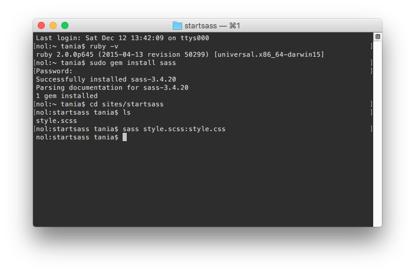
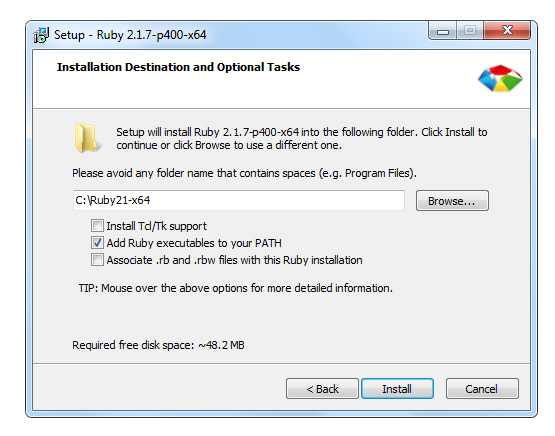
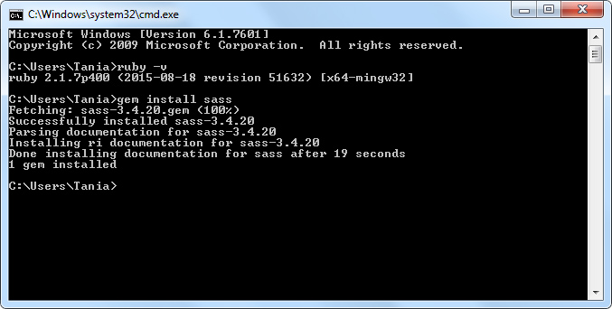
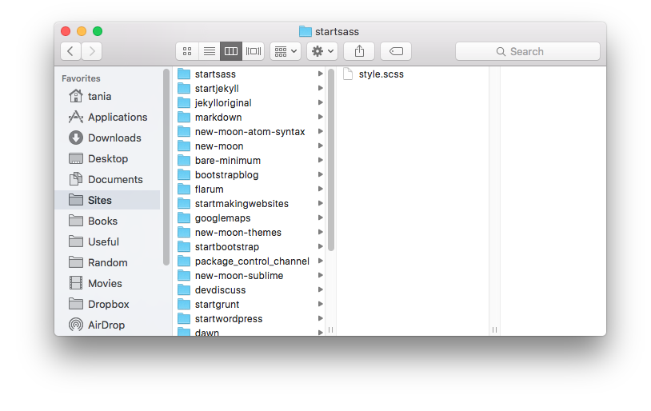
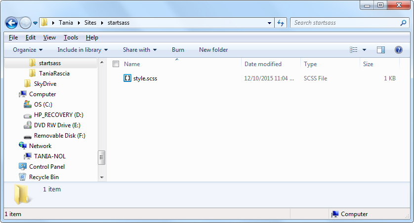

Sass is a CSS preproccessor that can make writing CSS faster and more efficient. You might have heard of Sass, but not know how to set it up or integrate it with your projects. We'll go over all of that in this tutorial for Mac and Windows.

#### Prerequisities

- Basic knowledge of CSS and HTML

#### Goals:

- Learn what a CSS preprocessor can do
- Install the necessary prerequisites for Sass
- Use the command line to compile SCSS into CSS
- Create a Sass project

If you've never used the command line before, don't worry - I'll go over everything you need to know. It's easy, fast, and powerful, and you only need to know a few very simple lines of code. The command lines will be the same for Windows and Mac in this case.

## What is a CSS preprocessor?

A preprocessor is a program that takes a bit of code and compiles it into a different bit of code. In the case of CSS preprocessors, we're compiling the Sass language into regular old CSS that the browser can interpret. Therefore, the code you use on your HTML page will be the same as with CSS; all the compiling will go on behind the scenes.

```html
<link href="style.css" rel="stylesheet" />
```

## LESS or Sass? Which should I use?

[LESS](http://lesscss.org/) and [Sass](http://sass-lang.com/) are both CSS preprocessors, that do the same thing with the same end goal. LESS runs on Node.js, and Sass runs on Ruby. [Compare CSS PREprocessors](http://csspre.com/compare/) is a very good source of information about the actual differences between the two, and a third option known as [Stylus](https://learnboost.github.io/stylus/).

LESS and Sass are more similar than they are different. If you know how to use one, you can easily switch to the other. However, Sass is more popular, and more widely used across a number of projects and frameworks. Big names are turning to Sass - for example, Bootstrap is switching from LESS to Sass for their next big release. It is useful to know and understand how to set up both.

## What's the difference between Sass and SCSS?

When I refer to Sass in this article, I'm referring to the entire Sass project. Within Sass, there are two different preprocessors:

- **Sass** - Syntactically Awesome StyleSheets: **.sass** extension
- **SCSS** - Sassy CSS: **.scss** extension

You can choose to use either, but throughout this article we're going to use **SCSS**. SCSS is more widely used, and much easier to get started with and integrate with existing projects - in fact, if you take any **.css** file and save it as a **.scss** file, it is now a valid SCSS file.

SCSS uses all the syntax we're familiar with in CSS: semi-colons and curly brackets.

```scss
p {
  font-size: 1em;
}
```

Sass does away with the syntax, and relies on forced indentation.

```sass
p
      font-size: 1em
```

It seems cleaner and easier, but as it is much more difficult to implement with existing projects, SCSS is the vastly more popular choice.

## Why should I learn Sass? How will it help me?

There is a bit of a learning curve when it comes to using and setting up Sass. You should already be proficient, or at least competent with CSS before attempting to learn a CSS preprocessor.

If you've ever had to change a color multiple times throughout your stylesheet and wished there was a better way, or had your stylesheet covered with vendor prefixes, or noticed that the stylesheet was long and difficult to maintain, that's enough reason to give learning Sass a go.

[The Sass Guide](http://sass-lang.com/guide) on their official documentation is a fantastic getting started guide to understanding what Sass can do. If you're not familiar, spend a few minutes going over the guide. It would be hard for me to make understanding the basics any clearer than they already have. Instead, I'll sum up a few of the terms.

- **Variable** - A variable is a storage container for a CSS value, such as a color or number. The syntax is written as `$variable`. You can use this code throughout the stylesheet after you have defined it.
- **Nesting** - Nesting reduces repetition in code and makes writing CSS faster and easier.
- **Partials** - Partials are SCSS files that begin with an underscore (`_partial.scss`) and are not compiled into their own CSS files, but are rather imported into a main file.
- **Import** - Use `@import` to compile all your partials into one file.
- **Mixins** - Use `@mixin` for repetitious CSS, such as when vendor prefixes are required.
- **Extend** - Use `@extend` to change a few key aspects of otherwise identical elements - such as a group of buttons with different colors.
- **Operators** - Operators allow you to use math calculations in your CSS - such as defining the width of various parts of a layout.

## Using the command line

Using the command line is the fastest, most efficient way to use Sass. As a front end web developer, it is highly likely that you will eventually be required to use a command line interface, or shell, in some way. If you've never used one before, now is the time to learn.

> Feel free to skip this small tutorial if you already know how to use the command line.

The most important part about using the command line is understanding that the exact same computer you already know can be accessed through the shell - it's simply a non-graphical window to your files. A GUI (Graphical User Interface) such as **Windows Explorer**, and a CLI (Command Line Interface) such as **Command Prompt** are just different methods of interacting with the same computer. From the shell, you can make folders/directories, save and view files, and so on.

On Windows, you can access the command prompt by clicking **Start**, typing `cmd` and opening the **Command Prompt** program, or pressing the Windows key, typing `cmd` and pressing enter.

You will automatically be located in your main directory.

C:\Users\Tania>

On a Mac, you can access the the terminal by finding **Terminal.app** in your Applications folder, or pressing CMD + Spacebar, typing `Terminal`, and pressing enter. Typing `pwd` will show you your working directory.

/Users/tania

At this point, there are only two commands that you need to know, and they're the same for Windows and Mac.

- `cd` - change directory
- `ls` - list directory contents

With `cd`, you can move around the folders in your computer. With `ls`, you can see all the files and folders contained within your current directory. (You might have to use the `dir` command on a Windows computer.)

> If you're moving to a directory with a space in the name, use quotes. `cd "My Documents"`. Otherwise, quotes are unnecessary. `cd documents`.

Play around with moving through directories on your computer for a few minutes so you get comfortable with using the command line. Type `cd ..` to go back one. You can use `mkdir` to create a folder, and view it. For example, test this code (press enter after each line, and use **"My Documents"** or **documents** depending on the OS).

```bash
cd "My Documents"
    mkdir cli-test
    ls
```

You should have moved to **My Documents**, made a new folder called **cli-test**, and viewed all the folders in "My Documents", including the new one we just made.

Got the hang of it? Now we're ready to move on.

## Installing Sass

Sass runs on the [Ruby programming language](https://www.ruby-lang.org/en/), and therefore Ruby must be installed on your computer.

### Mac

Ruby already comes preinstalled on OSX. Check to ensure you're running an up-to-date version by typing the following in Terminal.

```bash
ruby -v
```

If for some reason the number is lower than 2.0.0, type `sudo gem install ruby` to update. Now install Sass.

```bash
sudo gem install sass
```



All set!

### Windows

Installation for Windows is a bit trickier, since Windows doesn't have Ruby installed by default. Go to [The Ruby Installer](http://rubyinstaller.org/downloads/). From this point, you'll have to choose which version to install. Find the **2.1.x** link, and choose the **(x64)** version if your PC is running the 64-bit version. (You can check if you're running 32 or 64 in **Properties**.)

I'm running a 64-bit version of Windows 7, so I chose **Ruby 2.1.7 (x64)**, but it will be the same for Windows 8 or 10.



Be sure to select "Add Ruby executables to your PATH" and continue. I also had a Windows Firewall Warning pop up, but I just pressed "Allow Access" to continue everything worked fine. Once you've installed Ruby, open up the Command Prompt and confirm that Ruby is installed.

```bash
ruby -v
```

Then install Sass.

```bash
gem install sass
```



All set!

## Compile a SCSS file into a CSS file

From here out, the Sass commands are the same for Windows and Mac. I'm going to create a directory called **startsass** in **sites**. I've created a file called **styles.scss**.



I'm doing the same in Windows, so you can see it works the same in any OS.



The **styles.scss** file will be a very simple test to ensure we can compile the file. If I tried linking to it in the HTML, nothing would happen. We need to compile it to CSS. I'm creating a **variable** that contains a color, and applying that color to the `p` tag.

```scss
$primary-color: #343434;

p {
  font-color: $primary-color;
}
```

I'm going to navigate to my **startsass** directory in the shell.

```
cd sites/startsass
```

And compile the file. This is done by typing `sass` followed by your scss file, a colon, and the file you want it to compile into.

```
sass style.scss:style.css
```

Congratulations, you've successfully compiled a SCSS file! As you can see, a few files were created: a source map (**.css.map**), a regular **.css** file, and a **.sass-cache** directory.


The source map can help you debug your code in the future. The sass cache mostly exists to speed up compilation, and you don't really have to worry about it.

The important part here is that **style.css** has been created, and it looks like this.

```css
p {
  font-color: #343434;
}
```

This is good, and it works, but it would be really annoying if you had to run a command every time you wanted to make a change to a file. Fortunately, we can remedy this with a Sass watch.

## Watch for changes and compile automatically

Using `sass --watch`, we can keep a running process that will notice every time you make a change to your file and compile it to CSS.

```bash
sass --watch style.scss:style.css
```

> > > Sass is watching for changes. Press Ctrl-C to stop.

Any change I make to the file will be automaticaly compiled.

> > > Change detected to: style.scss

        write style.css
        write style.css.map

We can make this even a step better by compressing the compiled CSS file. Compressed CSS loads faster than the default, indented CSS. Add `--style compressed` to the end of your command. If you like, you can name the output file **style.min.css** to make it obvious that it's a minified file, but that isn't required.

```bash
sass --watch style.scss:style.min.css --style compressed
```

By now, we have a pretty good workflow going - SCSS is automatically compiling into minified CSS. You can link to your output CSS file in HTML and work on the SCSS file on the fly.

## Creating a Sass project

One of the great things about Sass is being able to organize your project. Instead of having one huge CSS file that becomes hard to maintain, you can compartmentalize all the components of your site into multiple files known as **partials**, and compile them into one, minified CSS file. Any change made to these partials will be detected, and the main file will be updated.

I'm going to create a very simple example of a Sass project. There is any number of ways you can organize your project - compiled css in a **dist** folder, and scss source code in a **src** folder is one way. I'm just going to create a **css** folder and a **sass** folder inside of one project for simplicity.

It's good to organize and separate your content, but I also wouldn't go overboard with creating so many files and directories that it becomes a task to find where something is. Everything should have a utility and be obviously named.

There is no specific right or wrong way to do this. Look it up and you'll find plenty of examples. Use the one that works and makes sense to you. The important thing to know is that every file in your project will start with an underscore except for the main scss file.

- **css**

  - main.css

- **sass**

  - main.scss


    * **base**

      * _variables.scss
      * _mixins.scss
      * _reset.scss


    * **components**

      * _typography.scss
      * _grid.scss
      * _buttons.scss
      * _navigation.scss
      * _sections.scss

Here is a more visual version of that project layout.


In this particular project, I'm putting all my global variables and mixins in the **base** directory, along with any resets I might need. In the **components** directory, I'll put all the styles for grid, navigation, typography, etc. I'll use **\_sections.scss** to put my code for individual sections of the page. If your project is very large, you might create a more specific directories. Do what works best for you.

The **main.scss** file will import all the partials from all the directories. You won't need to add the underscore or extension when importing the filenames - instead of "\_variables.scss" you will simply write "variables".

Here's how the **main.scss** file will look for this particular project.

```scss
// Base

@import 'base/variables';
@import 'base/mixins';
@import 'base/reset';

// Components

@import 'components/typography';
@import 'components/grid';
@import 'components/buttons';
@import 'components/navigation';
@import 'components/sections';
```

Now I can watch this entire project and compile everything into one, minified CSS file with a single command.

```bash
sass --watch sass:css --style compressed
```

With this command, I'm watching the entire **sass** directory for changes, and telling it compile into the **css** directory, and compress the output.

> > > Sass is watching for changes. Press Ctrl-C to stop.

       write css/main.css
      write css/main.css.map

Any change in the directory will be registered.

> > > Change detected to: sass/components/\_grid.scss

       write css/main.css
      write css/main.css.map

## Conclusion

There are other ways to use and compile Sass - for example, a Jekyll site has Sass compilation built in, and I've written about that in my [Make a Static Website with Jekyll](http://www.taniarascia.com/make-a-static-website-with-jekyll/) article. You may want to learn how to integrate Sass into a task runner, such as Grunt or Gulp. [Getting Started with Grunt and Sass](http://www.taniarascia.com/getting-started-with-grunt-and-sass/) will guide you through that process.

From here you can build your own framework, or integrate with Bootstrap, Foundation, or a number of other frameworks and systems.
