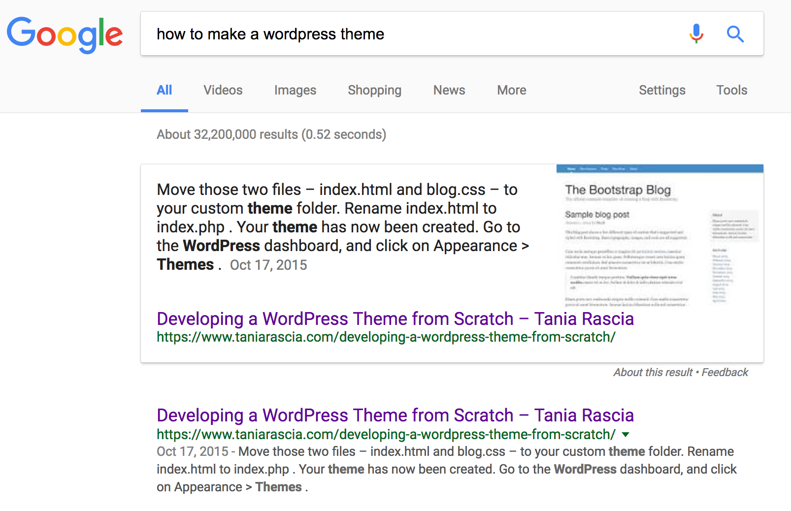
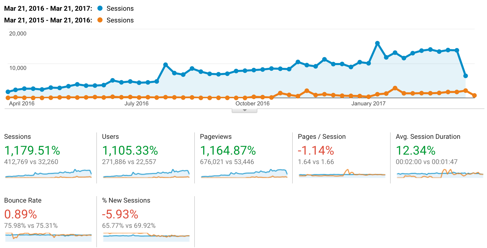
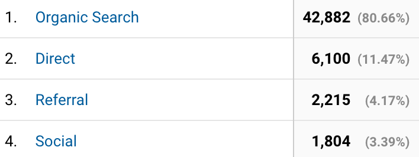

Most of the traffic to my site comes from organic Google searches. Searching for [how to make a wordpress theme](https://www.google.com/search?q=how+to+make+a+wordpress+theme), [how to use bootstrap](https://www.google.com/search?q=how+to+use+bootstrap), and [jekyll tutorial](https://www.google.com/search?q=jekyll+tutorial), including variations thereof and other popular search phrases, will list my site as one of the first results (as of writing this article in 2017).

Sometimes, the algorithm will even choose my result as the [featured snippet](https://support.google.com/webmasters/answer/6229325?hl=en).



Here is a graph comparing my analytics data from **March 21, 2016 - March 21, 2017** and the same dates of previous year. March 21, 2015 is the first date I had analytics on my website, so the site's been around for just over two years!



As a result of this data, many people have asked me what I do for SEO and if I can write an article on the subject. I'm not an expert, but I will share what I do and what I know with you.

Additionally, everything I mention here will be free and ad-less, and I do not use ads or adwords and have never paid a single cent for any sort of promotion or SEO.

> This article is about optimizing search results with Google. I don't know anything about Bing, and I'm fairly certain they don't know I exist.

To begin, the first and more important step, by far.

## Make good content

Google is [very clear](https://support.google.com/webmasters/answer/40349?hl=en) about this:

> Provide high-quality content on your pages, especially your homepage. **This is the single most important thing to do.**

This really cannot be overstressed, and I'd happily end the article right here. Aside from the fact that it's the right thing to do, Google's algorithms are always getting smarter, and attempts to hack the system will ultimately end up lowering your score. Examples of bad SEO practices would be spamming hidden keywords in the code, having duplicate content, and featuring low-quality and irrelevant guest posts.

If a website's aim is to create as many pages as possible with click-bait titles in order to gain ad revenue, it may see some initial relative success. However, people **leaving the site right away** (high bounce rate), a **lack of people linking to the site** (low referrals) and **few people directly visiting the site** (low directs) will ultimately negatively factor into search ranking.

Social media does not necessarily factor into search rankings, either. Here is how people found my site (acquisition data) from **February 1st to 28th of 2017**.



Of all sessions, 80% were organic, 11% direct hits, 4% from referrals, and only 3% from social means (reddit, Twitter, Facebook, etc). I don't post or proselytize often, which may have something to do with the low percent of social media, but it hasn't negatively affected my rankings.

> A [session](https://support.google.com/analytics/answer/2731565?hl=en) is not the same as a page hit - it can multiple contain interactions within a certain time frame by a single user.

If you're proud of your content and it provides value to others, all it takes is finding a few people who love what you have to say to begin growing.

## Make your site mobile friendly

Google also has [strong opinions](<a href=) on this matter:

> **If you haven't made your website mobile-friendly, you should.** The majority of users coming to your site are likely to be using a mobile device.

You can run your site through the [Mobile-Friendly Test](https://search.google.com/search-console/mobile-friendly) to check.

As a web developer, the biggest part of this is making sure your website is responsive/adaptive to multiple screen sizes. I wrote an article about [understanding the fundamentals of responsive design](https://www.taniarascia.com/you-dont-need-a-framework/) previously. Frameworks such as [Bootstrap](https://www.taniarascia.com/what-is-bootstrap-and-how-do-i-use-it/) also make this achievable.

## Make your site accessible

[Web accessibility](https://en.wikipedia.org/wiki/Web_accessibility) is the practice of making your site more friendly to people with disabilities. This includes people who have **visual impairments** (blindness, poor vision) or **auditory impairments** (deafness or hard of hearing), among other disabilities.

I won't go into extensive detail for now (perhaps later in another article) - I'll just be listing a few major points. However, it's important to be aware of accessibility issues and understand that it does factor into search engine optimization.

**Resources**: [WAVE](http://wave.webaim.org/) (Web Accessibility Evaluation Tool), [Wuhcag](https://www.wuhcag.com/) (Web accessibility for developers).

### Screen reader text

People with blindness and vision impairments use [screen reader software](https://en.wikipedia.org/wiki/Screen_reader), and rely entirely on text where we might get visual cues from images or icons.

In order to provide context to these visual cues, create a `screen-reader-text` class. Anything you place in that class will be hidden for screens but still supply the text for the readers. Use this instead of `display: none` or `visibility: hidden`.

> This class is often also written as `sr-only`.

```css
.screen-reader-text {
  clip: rect(1px, 1px, 1px, 1px);
  position: absolute !important;
  height: 1px;
  width: 1px;
  overflow: hidden;
}
```

### Include a skip navigation link

Using the `screen-reader-text` class, you can add a visually hidden link before the navigation of your site so users don't have to tab through each navigation item

```html
<a href="#main-content" class="screen-reader-text">Skip Navigation</a>
<nav>
  ...
</nav>

<main id="main-content"></main>
```

### Give your images alt tags

Another important way to make your site more accessible is to add `alt` tags to describe images.

```html

```

(This is something I still need to work on.)

### Use semantic HTML

Using proper [semantic structure](http://webaim.org/techniques/semanticstructure/) in your HTML is important for screen readers to be able to quickly and accurately find content. This means using proper heading tags (`<h1>` through `<h5>`), list tags(`<ul>`, `<ol>`), and semantic layout tags (`<article>`, `<section>`).

View a complete [WCAG 2.0 checklist](https://www.wuhcag.com/wcag-checklist/).

## Make your site faster

[Website speed](https://webmasters.googleblog.com/2010/04/using-site-speed-in-web-search-ranking.html) has played a factor in SEO for a long time. There's no quick fix to speed up a website - it depends on many factors from server quality to size of assets, number of requests, and so on.

A good idea to get started is to run your site through the various speed checking tools online and see where the biggest issues lie. As a note, I'd caution againt getting _too_ obsessed with optimizing page speed - for example, getting a perfect score on Google's PageSpeed Tools is nearly impossible, and there are more important things you can spend your time on.

I'll mention a few methods that are relatively easy to implement.

**Resources:** [Google PageSpeed Insights](https://developers.google.com/speed/pagespeed/), [Pingdom Website Speed Test](https://tools.pingdom.com/), [WebPageTest](http://www.webpagetest.org/), [GT Metrix](https://gtmetrix.com/)

### Use a CDN

You can connect to a CDN provider, such as [CloudFlare](https://www.cloudflare.com/), to instantly speed up your website and reduce bandwidth costs. For a simple, personal account such as mine, CloudFlare is free. In order to use the CDN, you'll set your domain's nameservers to the new ones that CloudFlare provides.

### Minify JavaScript and CSS

Using a task runner such as [Gulp](https://www.taniarascia.com/getting-started-with-gulp/) or [Grunt](https://www.taniarascia.com/getting-started-with-grunt-and-sass/), you can set your JavaScript and CSS to automatically minify, which means reducing all whitespace and unnecessary characters. This reduces the size of your script and stylesheet assets

### Optimize images

Images are usually the largest assets that your website will serve. Optimizing and compressing images is a good and easy way to reduce load speed. You can use a browser based tool such as [Optimizilla](http://optimizilla.com/) or [TinyPNG](https://tinypng.com/), download the optimized contents from Google PageSpeed Insights, or use a [task runner](https://github.com/sindresorhus/gulp-imagemin). If you're using WordPress, you can use a plugin such as [WP Smush It](https://wordpress.org/plugins/wp-smushit/).

### Enable Gzip compression

Gzip compression drastically reduces the file size of your HTML and other assets. [This guide](https://varvy.com/pagespeed/enable-compression.html) by Patrick Sexton demonstrates how to enable Gzip on various types of servers (Apache, NGINX).

### Leverage browser caching

Browser caching is a client side method of loading pages faster. It tells the server to save the files for a specified amount of time instead of fetching all assets every time the page is loaded. Here's [another great guide](https://varvy.com/pagespeed/leverage-browser-caching.html) by the same author as above on taking advantage of browser caching.

## Create a Google Analytics account

[Google Analytics](https://analytics.google.com/analytics/web/) tracks and reports website traffic. The graphs and information I used in this post are from Google Analytics. [Sign up for an account](https://support.google.com/analytics/answer/1009694?hl=en) and create a property for your website, and verify domain ownership.

In the admin area, you'll find a tracking code that you will place in the `<head>` of all pages that should be tracked. Once that's in place, Analytics will begin tracking your traffic.

## Connect to Google Search Console

[Google Search Console](https://www.google.com/webmasters/tools/home?hl=en), part of Google Webmaster Tools, is an addition to Google Analytics for web developers. Create an account by adding a property, associating it with your Google Analytics account, and verifying your domain.

Search Console will tell you the search terms people typed to find your site organically. It will also allow you to check for crawl errors, security issues, and fetch the site as Google.

### Use structured data

[Structured data](https://developers.google.com/search/docs/guides/intro-structured-data) is another way search engines recognize the content on a website.

[JSON LD](http://json-ld.org/), or JSON for Linking Data, is Google's preferred way of receiving [Schema](https://schema.org/) (structured data) information. Below is one example of a type of JSON LD schema - a person. I used myself as the example. I would simply put this script in the footer of my website.

```html
<script type="application/ld+json">
  {
    "@context": "http://schema.org",
    "@type": "Person",
    "image": "tania.jpg",
    "jobTitle": "Web developer",
    "name": "Tania Rascia",
    "gender": "female",
    "url": "https://www.taniarascia.com",
    "sameAs": ["https://github.com/taniarascia", "https://twitter.com/taniarascia"]
  }
</script>
```

A list of all types and properties can be found [here](https://developers.google.com/search/docs/data-types/data-type-selector).

[Microdata](https://developers.google.com/schemas/formats/microdata) would be an alternative, less preferred way of adding Schema data to your website.

## Create a sitemap

A sitemap helps the search engine crawlers index and understand your website. You can generate a sitemap with free browser based tool such as [XML Sitemap Generator](https://xmlsitemapgenerator.org/). If you're using WordPress, use the [Google Sitemap Generator](https://wordpress.org/plugins/google-sitemap-generator/) plugin.

## Use HTTPS encryption

In an effort to improve internet security, Google made HTTPS encryption via SSL/TLS a [ranking factor](https://webmasters.googleblog.com/2014/08/https-as-ranking-signal.html) in 2014.

You can use [Let's Encrypt](https://letsencrypt.org/) to set up a valid HTTPS connection. Otherwise, I [wrote this guide](https://www.taniarascia.com/https-ssl-tls-certificate-how-to/) on how to use one of the standard certificate services.

## Conclusion

My aim was to share with you all the resources and strategies I use to keep track of my website and maintain good standards. Making high-quality content will always be the most important factor in having a high search ranking, but hopefully this article alerted you to additional steps you can take to make sure your website is optimized for speed and accessibility. If you have anything to add, think I left something out, or were confused by any steps, please let me know so I can improve the article.
