I've noticed a lot of web developers struggle with design; they think they don't have a natural talent for design and knowing what looks good, and everything they create from scratch is **doomed to look amateur and unprofessional**.

To combat this issue, developers often use CSS frameworks like [Bootstrap](http://getbootstrap.com/) and [Foundation](https://foundation.zurb.com/), that come with a set of sensible defaults and themes that can be added on for a sense of a customized look. There's no shame in turning to one of these solutions, and certainly they might be mandatory to use at some companies for consistency. If you'd just like to learn how to get started with Bootstrap, I'd recommend [What is Bootstrap and How Do I Use It?](https://www.taniarascia.com/what-is-bootstrap-and-how-do-i-use-it/).

However, you might be a developer that wants to improve his or her own design, or build your own custom portfolio with a unique style or custom CSS. In this case, you probably find it hard to find any sort of resource with **clear, concrete tips** to improve your design. Sure, you'll find articles at the top of the Google results that tell you to "study design theory" or "learn to identify good design", but these tips are vague and don't help your design _now_.

So I've decided to list a few things I always watch out for, specific to web design, that **you can use to critique your own site right now and improve it**.

We will be creating a website element (a card) from scratch, using the design principles I list here, **step by step**.

#### Prerequisites

- Basic knowledge of HTML and CSS.

#### Goals

- Develop a card element from scratch using the each of the design guidelines we learn here.

- Learn **specific actions** you can take to improve your design and make it look more professional.

- Apply those guidelines to our finished element to show how we can customize and create totally different, creative designs with a few code changes.

## Finished Product

Here is what we will start with.

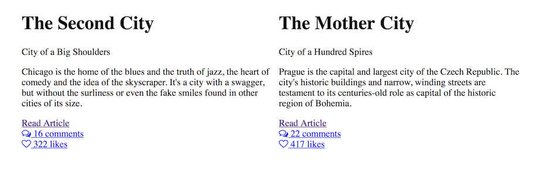

Here is what we will end up with. You can view a working, responsive, coded version of it [here](https://taniarascia.github.io/card/).


Why Prague and Chicago? Because I'm from Chicago, and I started writing this article in Prague. (In Munich now...we'll see where I am when I finish).

[View Demo](https://taniarascia.github.io/card/) [View GitHub Repo](https://github.com/taniarascia/card/)

Note that the start is not actually bad design, but unstyled. It's easier to make a good design from nothing, than improve a bad one. However, all these guidelines can be used one-by-one to check for problems in your design.

## Design Guidelines

      * Structure layout first
      * Use more padding
      * Use more line height on body than headings
      * Do not use pure black
      * Use fewer fonts, or be consistent with fonts
      * Use fewer colors, or complementary colors
      * Be consistent with borders and corners
      * Fine details, transitions and animations last
      * Don’t go overboard with drop shadows, gradients, or animations

So, let's begin!

## Step Zero: HTML

First, I'm going to set up the HTML here and the rest of the article will only focus on CSS. A basic overview of how the card is structured is here. (I'm leaving out the image as it's not the focus. We'll just add it at the end.)

index.html

```html
<div class="card">
  <div class="card-content">
    <!-- title and content will go here -->

    <div class="card-details">
      <!-- read article, comments, and likes will go here -->
    </div>
  </div>
</div>
```

Here is the actual, final HTML for one card. It's inside a container to keep the shape, but there are no other styles, normalizers, resets, or any CSS applied yet.

index.html

```html
<div class="card">
  <div class="card-content">
    <h1>The Second City</h1>
    <div class="subtitle">City of Big Shoulders</div>
    <p>
      Chicago is the home of the blues and the truth of jazz, the heart of comedy and the idea of
      the skyscraper. It's a city with a swagger, but without the surliness or even the fake smiles
      found in other cities of its size.
    </p>

    <div class="card-details">
      <div class="card-details-inner">
        <div class="read-more">
          <a class="button" href="https://en.wikivoyage.org/wiki/Chicago">Read Article</a>
        </div>
        <div class="options">
          <div class="comments">
            <a href="#!">
              <i class="fa fa-comments-o"></i>
              16 comments
            </a>
          </div>
          <div class="likes">
            <a href="#!">
              <i class="fa fa-heart-o"></i>
              322 likes
            </a>
          </div>
        </div>
      </div>
    </div>
  </div>
</div>
```

Here is where we begin.

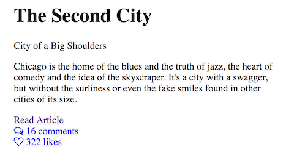

There's going to be a typo on this throughout the entire thing, so do me the favor of ignoring it.

## Structure layout first

Before doing any design, you should figure out structure of the layout first. This means anything that uses `flex`, `float`, `position`, etc, without letting style and design get in the way. Since this article focuses on the design, I won't go into much detail about how `flex` and `absolute` positioning work, but I'll explain what's happening. Here is our code, in scss.

```scss
.card {
  flex: 1 1 50%;
  position: relative;
  border: 1px solid #efefef;
}

.card-content {
  padding: 0 0 30px;
}

.card-details {
  position: absolute;
  width: 100%;
  bottom: 0;
  left: 0;
}

.card-details-inner {
  display: flex;
  justify-content: space-between;
  align-items: center;
}
```

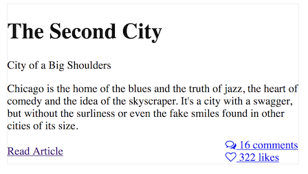

Okay, it looks like a whole lot of code for almost no change whatsoever. But here's what's happening:

- Each card will be equal in size, but **not exceed 50% width of the outer container**, meaning there will only ever be two cards side-by-side.
- The details section on the bottom (read more, comments, etc) will be **absolutely positioned to the bottom**. Why? So that they'll always be equally placed at the bottom, no matter how much content is in the card.
- The two halves of the details section will be **placed to the left and right and vertically centered**. "Read more" on the left, "Comments" and "Likes" on the right.

I've only included the border so we can see the Now everything that has to do with layout of the card is taken care of, and we can begin to style it.

## Use More Padding

This is the number one issue I see that indicates to me that someone is an amateur at design: **not enough padding, or inconsistent padding and margins**.

We're going to add an equal amount of padding around the four sides of the card (`30px`), adding extra to to bottom to account for the `absolute` positioning.

```scss
.card-content {
  padding: 30px 30px 110px;
}

.card-details-inner {
  border-top: 1px solid #efefef;
  margin: 0 30px;
  padding: 30px 0;
}
```

I'm also going to remove the top margin of the `<h1>` so it doesn't interfere with the equal padding of the element. I prefer to remove all top margins and only use bottom margins. This is personal preference, but it works best for me.

```scss
.card h1 {
  margin: 0;
}

.card p {
  margin: 0 0 30px;
}

.subtitle {
  margin: 0 0 15px;
}
```

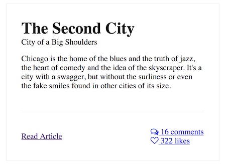

I think it's starting to look better already. You might notice there seems to be too much space around the bottom details area, but that's only because the "Read Article" link will become a button - otherwise we would use less.

## Use more line height on body than headings

Headings should have less line height than body text. A good amount is `1.2` for headings, and `1.5` to `1.6` for body text. The "golden ratio" is supposedly `1.61803399`, but nobody has time for that many numbers. Here's a code I usually use as the standard for all my websites, and only adjust if necessary.

```css
html {
  line-height: 1.6;
}

h1,
h2,
h3,
h4,
h5 {
  line-height: 1.2;
}
```


It's getting a little more spaced out and readable now.

## Do not use pure black

Pure black, as in `black` or `#000000`, is particularly harsh and should be avoided, both for text and backgrounds.

I'm going to use a solid nice gray, `#444444` for the main text, and a muted `#666666` for the card body font.

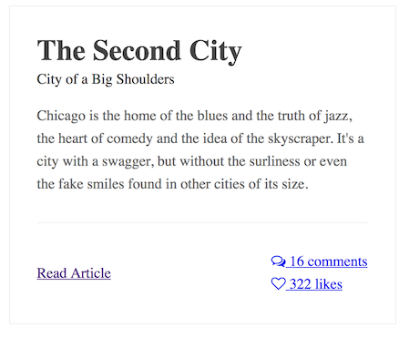

It's less harsh and more pleasant on the eyes.

## Use fewer fonts, or be consistent with fonts

If you really don't know what you're doing with fonts, here's an easy bit of advice: **just use one font family (typeface)**. A typeface is the entire family of fonts that includes all the bold and italicized versions. We'll just refer to them all as fonts from here out because that's more familiar.

[Google Fonts](http://fonts.google.com/) is of course a great resource to find custom fonts to use in your project. Sort by "popular" and any of the top 20 fonts on there should be perfectly acceptable to use. I'm going to use Nunito, a nice popular font, with one regular width and one bold width. (`400` and `700`).

Load it in...

```html
<link rel="stylesheet" href="https://fonts.googleapis.com/css?family=Nunito:400,700" />
```

```css
html {
  font-family: 'Nunito', sans-serif;
}
```

And here it is.

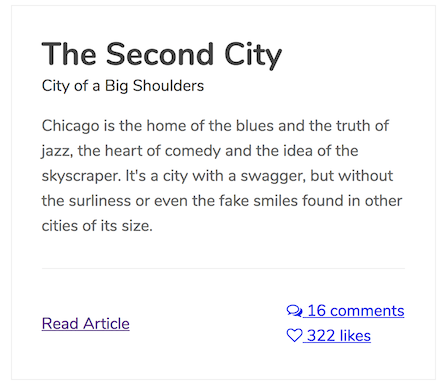

Another tip: add this code to all your projects to make the text more clear, crisp and defined on all browsers.

```css
html {
  -webkit-font-smoothing: antialiased;
  -moz-osx-font-smoothing: grayscale;
}
```

The headings are set to bold by default, but I also want my subtitle to be bold.

```css
.subtitle {
  font-weight: 700;
}
```

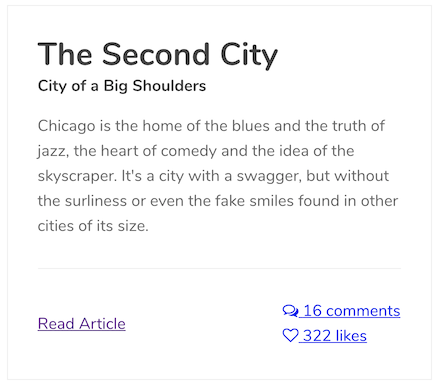

Okay, so maybe you don't like just one font, and you want to use more than one. That makes perfect sense, but at try to follow this rule:** make all headings one font, and all body text the other font**. For example, you can choose to have all headings a serif font (font with tails, such as Times New Roman) and all body text a sans-serif font (font without tails, such as Arial). Or the other way around.

**Consistency is key**. Attempting to be super creative and different when you're not familiar with design is where most of bad design comes from. Keep it simple until you learn more.

## Use fewer colors, or complementary colors

Same advice applies to colors as to fonts when you're new to design: if you don't know what you're doing, **just use one color**. The example we're making just uses one color.

Want to use more than one color? That makes sense, but at least use the **complementary color wheel**. Here's one for you to look at.

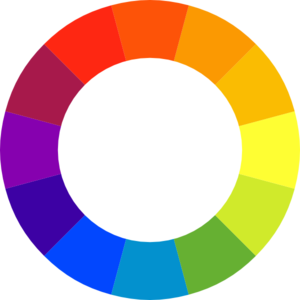

If you're not familiar with it from first grade art class, just look at opposite ends of the wheel and match them. Blue and orange. Purple and yellow. Generally more subdued colors look better on the web.

I chose `#E76C67`, a flat reddish-orange for the color of our design. I could have as easily chose blue, purple, or green, because all of them would look fine with black and white, but I chose this one.

```css
a {
  color: #e76c67;
  text-decoration: none;
}

.subtitle {
  margin: 0 0 15px;
  font-weight: 700;
  font-size: 1.25rem;
  color: #e76c67;
}
```

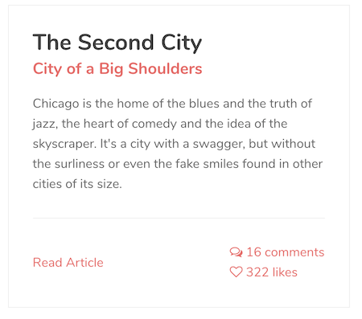

Now we have some color to the design, and as it's only one, it has nothing to clash with.

## Be consistent with borders and corners

If you're going to have round corners, use round corners throughout all your elements: forms, buttons, cards, etc. If you're going to have square corners, use square corners throughout all your elements. **Keep your borders and border-radius consistent.** I'm sure you're noticing consistency is a common theme throughout this article, and it's for good reason.

I'm going to go with sharp corners in our example - no border radius on any of my elements. That means my card and buttons (and if it were a full website, my form inputs as well) will all be rectangles. If I wanted to use rounded corners, I should make sure everything has rounded corners.

If your buttons have a `1px` border, make sure your forms have a `1px` border as well. Make sure the hover and active states match the border size of the regular element so the shape doesn't change on hover and tab.

Here's the CSS for our button.

```css
.button {
  display: block;
  font-size: 1rem;
  background: #e76c67;
  border: 1px solid #e76c67;
  padding: 0.75rem 1rem;
  color: white;
  text-decoration: none;
  font-weight: 700;
  text-align: center;
}

.button:hover,
.button:focus {
  background: darken(#e76c67, 10%);
  border: 1px solid darken(#e76c67, 10%);
}
```

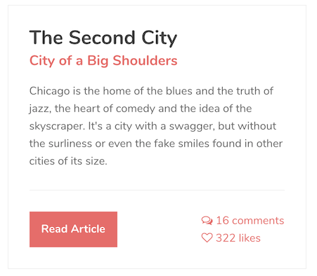

## Fine details, transitions and animations last

If the first thing you're doing is putting a gradient or box shadow into your empty design, there's a problem. Transitions, animations, box shadows, and other small details should be added last, after your layout, fonts, and colors have all been chose.

I'm going to add a subtle box shadow to the card element.

```css
.card {
  box-shadow: 2px 6px 25px rgba(0, 0, 0, 0.1);
  transition: all 0.3s ease;
  position: relative;
}
.card:hover {
  box-shadow: 2px 6px 30px rgba(0, 0, 0, 0.2);
}
```

I also prefer the bottom card details to be gray, with a bit more space between the elements.

```css
.options a {
  color: #666666;
}

.options a:hover {
  color: #222222;
}

.fa {
  margin-right: 0.25rem;
}
```

Here's our final card.

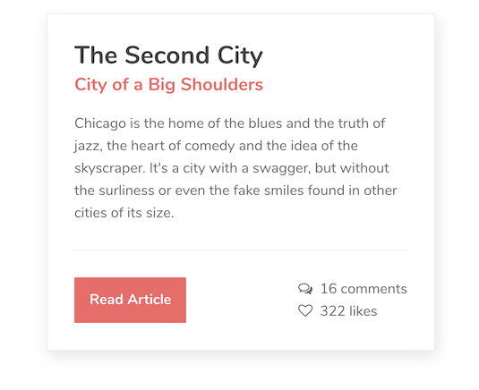

Let's just add in an image really fast.

```css
.card-image {
  height: 200px;
  background-size: cover;
  background-position: center center;
  background-repeat: no-repeat;
}
```

The HTML, which is set up to allow the image to load in via CMS.

```html
<div class="card-image" style="background-image: url(images/chicago.jpg)"></div>
```

And here we are, the final version!


## Don't go overboard with drop shadows, gradients, or animations

Not much more to be said. If your elements are swooping all throughout the page from every direction, your website is going to be annoying to navigate.

Also, I just realized I put "City of a Big Shoulders" instead of "City of Big Shoulders", so please ignore the typo. I'm not redoing the whole thing!

## Play around with it a bit

Maybe you want the "big time San Francisco tech company" look.

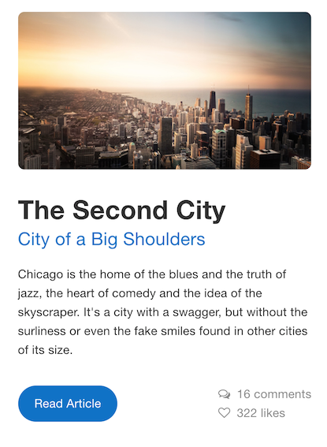

Video game?

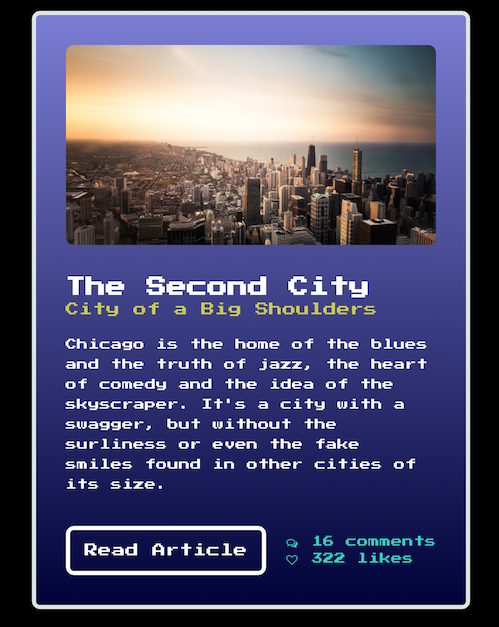

[New Moon](https://taniarascia.github.io/new-moon/) theme?

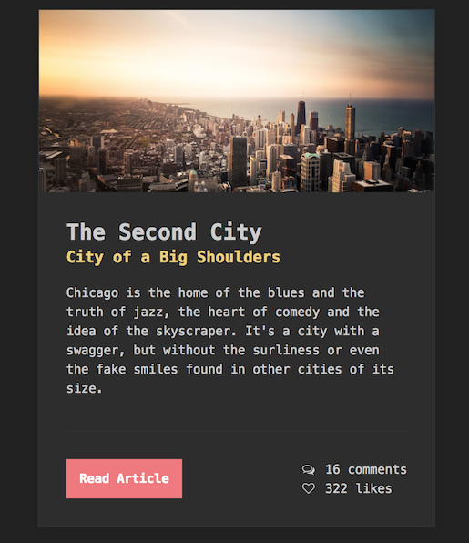

Whatever you want!

## Conclusion

Got lost anywhere? Have something to add? Hate everything I said? Leave it in the comments below!

You can use these guidelines to critique your own design. Do you need more padding? Do you have too many or inconsistent fonts? Are you using three different border radii?

Here is the demo and source code.

[View Final Product](https://taniarascia.github.io/card/) [View Source Code](https://github.com/taniarascia/card)
