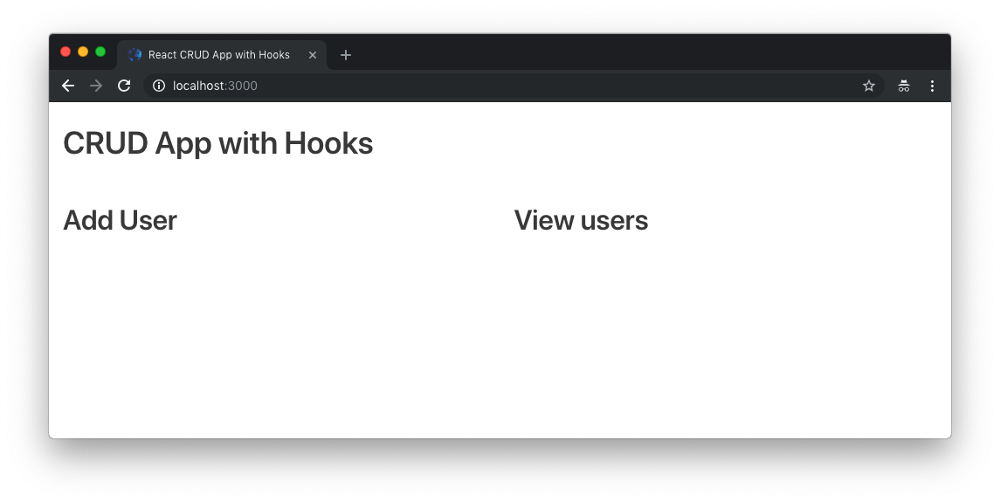
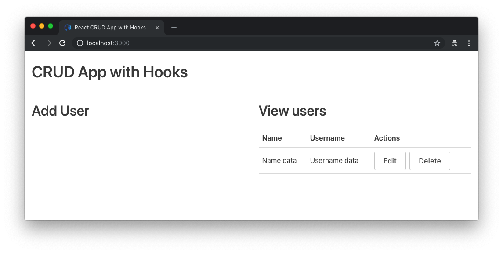
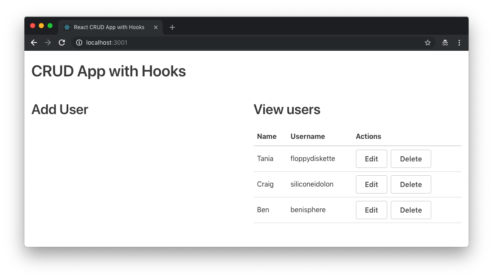
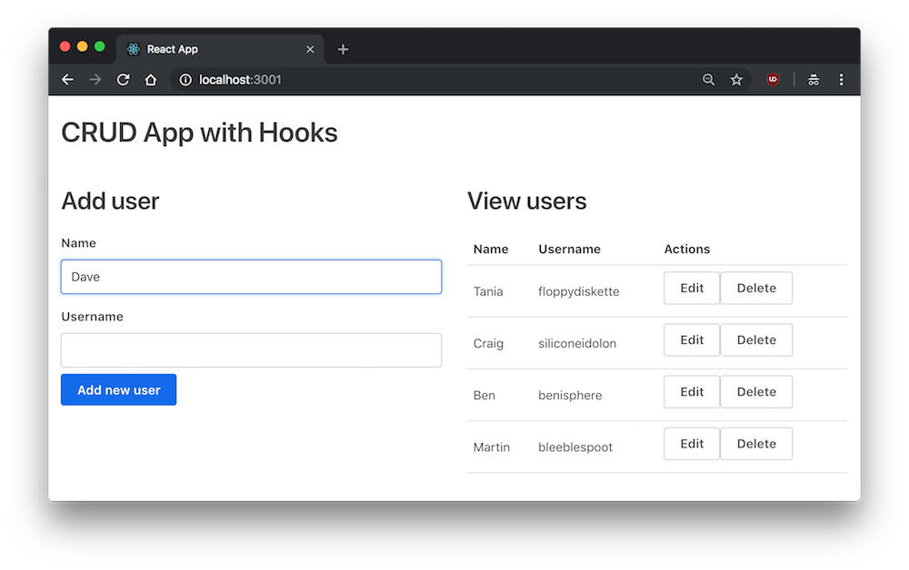
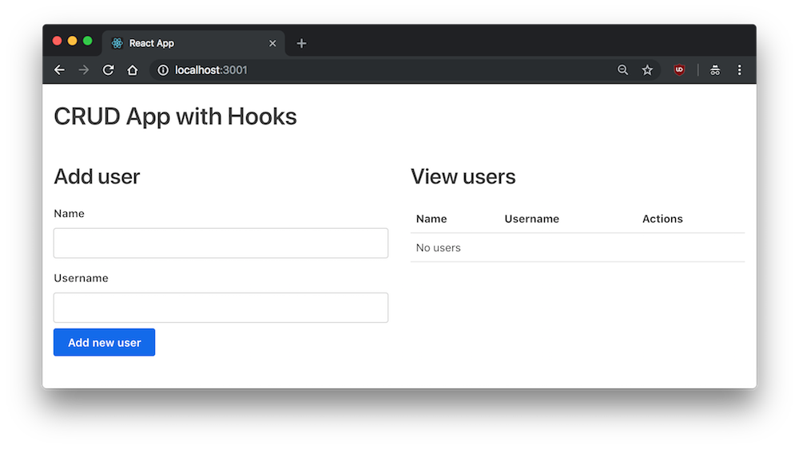

In the latest release of React, a new concept was introduced - [Hooks](https://reactjs.org/docs/hooks-intro.html). Hooks are being added to React as an alternative to classes. If you use React right now, you'll be familiar with **simple (functional) components** and **class components**.

Simple component

```jsx
const Example = () => {
  return <div>I'm a simple component</div>
}
```

Class component

```jsx
class Example extends Component {
  render() {
    return <div>I'm a class component</div>
  }
}
```

Many of the features available to classes - such as **lifecycle methods** and **state** - have not been available to simple components, until now. The new Hooks proposal adds all that functionality and more.

I wanted to try out Hooks and see how an app might look without any classes, but I didn't see any examples yet, so I decided to make one myself. I created a simple CRUD (create, read, update, delete) app that utilizes Hooks and no classes, and I created this tutorial for anyone else who wants to learn how to use them as well.

If you don't know how to make a simple CRUD app in React, regardless of whether you use classes or hooks, this article will be good for you as well.

[View Demo App](https://taniarascia.github.io/react-hooks/) [View Source](https://github.com/taniarascia/react-hooks)

#### Prerequisites

In order to follow along with this tutorial, you'll need a basic knowledge of HTML, CSS, and JavaScript/ES6. You should also know the fundamentals of React, which you can learn by reading [Getting Started with React](https://www.taniarascia.com/getting-started-with-react/).

#### Goals

In this tutorial, we'll make a [simple CRUD app](https://taniarascia.github.io/react-hooks/). It will have users, and you'll be able to add, update, or delete users. We won't use any React classes, and instead we'll utilize State Hooks and Effect Hooks on functional components. If you get lost along the way, be sure to check out [the source of the completed project](https://github.com/taniarascia/react-hooks).

## Create React App with React v16.7.0

We'll start by installing the project with **create-react-app** (CRA).

```bash
npx create-react-app react-hooks
```

CRA will install React with the latest stable version.

```bash
brew install yarn --without-node
```

In `package.json`, ensure `react` and `react-dom` are `16.7.0`.

package.json

```json
"dependencies": {
        "react": "^16.7.0",
        "react-dom": "^16.7.0",

```

Then run `yarn`.

Now you're all set with the React.

## Initial Setup

Let's start off by clearing out all the files from the boilerplate we don't need. Delete everything from the `/src` folder except `App.js`, `index.js`, and `index.css`.

For `index.css`, I just copy and paste the CSS from [Primitive](https://taniarascia.github.io/primitive/css/main.css), a simple CSS boilerplate I made, as the point of this app is to work on React and not care about design. This CSS boilerplate just adds some sensible defaults and a simple grid so we can start prototyping.

In `index.js`, we'll simplify it by removing the references to Service Workers.

index.js

```jsx
import React from 'react'
import ReactDOM from 'react-dom'
import './index.css'
import App from './App'

ReactDOM.render(<App />, document.getElementById('root'))
```

And in `App.js`, I'll make a simple, functional component for `App` instead of a class.

App.js

```jsx
import React from 'react'

const App = () => {
  return (
    <div className='container'>
      <h1>CRUD App with Hooks</h1>
      <div className='flex-row'>
        <div className='flex-large'>
          <h2>Add user</h2>
        </div>
        <div className='flex-large'>
          <h2>View users</h2>
        </div>
      </div>
    </div>
  )
}

export default App
```

Now we have the initial setup and skeleton for the app.



## State vs. Hook State

If we look at a very simple example of a class component with state and a functional component with Hook state, we can see the similarities and differences. With class state, you get one main state object, and you update using methods on the class and `setState()`.

I'll make some quick example code, as if it were a library and you have books that have state.

Class Component State Example

```jsx
class App extends Component {
  initialState = {
    title: '',
    available: false,
  }

  state = initialState

  updateBook = book => {
    this.setState({ title: book.title, available: book.available })
  }
}
```

With Hook state, there's a getter and setter for each type of state (you can have as many as you want), and we obviously create functions instead of methods.

Hook State Example

```jsx
const App = () => {
  const initialBookState = {
    title: '',
    available: false,
  }

  const [book, setBook] = useState(initialBookState)

  const updateBook = book => {
    setBook({ title: book.title, available: book.available })
  }
}
```

I'm not going to get deep into the rationale behind hooks vs. class components, as you can read [all about it on React's Hooks introduction](https://reactjs.org/docs/hooks-intro.html). I'm just going to show you how to work with them to create a functional app.

## Setting up the View

The first thing we'll do is make some sample data and a table to display it, for the view. Create a new directory called `tables` in `src`, and a file within called `UserTable.js`. We'll make the skeleton for a table.

tables/UserTable.js

```jsx
import React from 'react'

const UserTable = () => (
  <table>
    <thead>
      <tr>
        <th>Name</th>
        <th>Username</th>
        <th>Actions</th>
      </tr>
    </thead>
    <tbody>
      <tr>
        <td>Name data</td>
        <td>Username data</td>
        <td>
          <button className='button muted-button'>Edit</button>
          <button className='button muted-button'>Delete</button>
        </td>
      </tr>
    </tbody>
  </table>
)

export default UserTable
```

Now just import the file and add in the new component.

App.js

```jsx
import React from 'react'
import UserTable from './tables/UserTable'

const App = () => {
  return (
    <div className='container'>
      <h1>CRUD App with Hooks</h1>
      <div className='flex-row'>
        <div className='flex-large'>
          <h2>Add user</h2>
        </div>
        <div className='flex-large'>
          <h2>View users</h2>
          <UserTable />
        </div>
      </div>
    </div>
  )
}

export default App
```



Let's bring in some random dummy data and the `useState` import from React.

App.js

```jsx
import React, { useState } from 'react'
import UserTable from './tables/UserTable'

const App = () => {
  const usersData = [
    { id: 1, name: 'Tania', username: 'floppydiskette' },
    { id: 2, name: 'Craig', username: 'siliconeidolon' },
    { id: 3, name: 'Ben', username: 'benisphere' },
  ]

  const [users, setUsers] = useState(usersData)

  return (
    <div className='container'>
      <h1>CRUD App with Hooks</h1>
      <div className='flex-row'>
        <div className='flex-large'>
          <h2>Add user</h2>
        </div>
        <div className='flex-large'>
          <h2>View users</h2>
          <UserTable users={users} />
        </div>
      </div>
    </div>
  )
}
```

Props works just as it did before. We'll map through the user data we sent through and display the properties for each user, or display a message if there are no users. The edit and delete buttons aren't hooked up to anything yet, so they won't do anything.

UserTable.js

```jsx
import React from 'react'

const UserTable = props => (
  <table>
    <thead>
      <tr>
        <th>Name</th>
        <th>Username</th>
        <th>Actions</th>
      </tr>
    </thead>
    <tbody>
      {props.users.length > 0 ? (
        props.users.map(user => (
          <tr key={user.id}>
            <td>{user.name}</td>
            <td>{user.username}</td>
            <td>
              <button className='button muted-button'>Edit</button>
              <button className='button muted-button'>Delete</button>
            </td>
          </tr>
        ))
      ) : (
        <tr>
          <td colSpan={3}>No users</td>
        </tr>
      )}
    </tbody>
  </table>
)

export default UserTable
```



We'll get to the edit and delete buttons in a moment. Now that the basic view is set up, let's get the adding functionality working.

## Adding a new user

We're going to set up the form to add a new user.

The very first thing we can do is create the actual function that will add the new user to state. We have the `setUsers` function automatically from `useState`, so that's what we'll use to update the user state.

Since we're not using a real API and database, which would probably have an auto-incrementing ID, I'm going to increment the ID of the new user manually. This function will take a `user` object as a parameter, and add them to the `users` array of objects. The `...users` code ensures that all the previous users remain in the array.

App.js

```jsx
const addUser = user => {
  user.id = users.length + 1
  setUsers([...users, user])
}
```

We're going to make a component for this, so I'll just go ahead and add the reference to the component at the top, and insert the component below the "Add user" header. We can pass the `addUser()` through as a prop. Make sure not to include the parentheses when we pass it through as a reference - `<AddUserForm addUser={addUser} />`, not `<AddUserForm addUser={addUser()} />`.

App.js

```jsx
import React, { useState } from 'react'
import UserTable from './tables/UserTable'
import AddUserForm from './forms/AddUserForm'

const App = () => {
  const usersData = [
    { id: 1, name: 'Tania', username: 'floppydiskette' },
    { id: 2, name: 'Craig', username: 'siliconeidolon' },
    { id: 3, name: 'Ben', username: 'benisphere' },
  ]

  const [users, setUsers] = useState(usersData)

  const addUser = user => {
    user.id = users.length + 1
    setUsers([...users, user])
  }

  return (
    <div className='container'>
      <h1>CRUD App with Hooks</h1>
      <div className='flex-row'>
        <div className='flex-large'>
          <h2>Add user</h2>
          <AddUserForm addUser={addUser} />
        </div>
        <div className='flex-large'>
          <h2>View users</h2>
          <UserTable users={users} />
        </div>
      </div>
    </div>
  )
}

export default App
```

Now we have to create a form that you can use to add the new user. Let's create a `forms` subdirectory with a file inside called `AddUserForm.js`.

App.js

```jsx
import React, { useState } from 'react'

const AddUserForm = props => {
  return (
    <form>
      <label>Name</label>
      <input type='text' name='name' value='' />
      <label>Username</label>
      <input type='text' name='username' value='' />
      <button>Add new user</button>
    </form>
  )
}

export default AddUserForm
```

Right now, the form is empty, and you cannot add any values to it due to our empty value strings, nor does the submit button do anything.

Just like before, we'll want to make some state, except this state will just be temporary, for keeping track of what's currently in the add user form.

I'm going to create an initial state with those empty values, and set the user state to the empty values. Having initial state in a variable is useful, because after we submit the form, we can return it to the initial, empty value.

AddUserForm.js

```jsx
const initialFormState = { id: null, name: '', username: '' }
const [user, setUser] = useState(initialFormState)
```

Now we'll create a function to update the state within the form. `event` always gets passed through to any `on` event in the DOM, so you'll see that as the parameter of the function. Object destructuring will allow us to easily get the `name` (key) and `value` from the form. Finally, we'll set the user much like we did on the `App` component, except this time we're using computed property names to dynamically set the name (using `[name]`) and value.

```jsx
const handleInputChange = event => {
  const { name, value } = event.target

  setUser({ ...user, [name]: value })
}
```

> If you don't understand what's being passed through, try playing around with `console.log(event)` in the input handling unction.

Now we extract the values from the state object, and reference our function in the `onChange` event.

```jsx
<form>
  <label>Name</label>
  <input type='text' name='name' value={user.name} onChange={handleInputChange} />
  <label>Username</label>
  <input type='text' name='username' value={user.username} onChange={handleInputChange} />
  <button>Add new user</button>
</form>
```

The last thing to take care of is actually submitting the form back to the `App` component. As we passed the function down with `props`, we're going to use props to access the function. I'm going to write an `onSubmit` function, and we'll prevent the default form submission from firing. I added a small bit of validation to make sure empty values cannot be submitted, and sent the user through to the add function. Finally, I'm using the setter to reset the form to its initial value after successful submission.

```jsx
<form
      onSubmit={event => {
        event.preventDefault()
        if (!user.name || !user.username) return

        props.addUser(user)
        setUser(initialFormState)
      }}
    >
```

Fortunately this code is pretty simple, as we don't have to worry about asynchronous API calls.

Here is our full `AddUserForm` component.

AddUserForm.js

```jsx
import React, { useState } from 'react'

const AddUserForm = props => {
  const initialFormState = { id: null, name: '', username: '' }
  const [user, setUser] = useState(initialFormState)

  const handleInputChange = event => {
    const { name, value } = event.target

    setUser({ ...user, [name]: value })
  }

  return (
    <form
      onSubmit={event => {
        event.preventDefault()
        if (!user.name || !user.username) return

        props.addUser(user)
        setUser(initialFormState)
      }}
    >
      <label>Name</label>
      <input type='text' name='name' value={user.name} onChange={handleInputChange} />
      <label>Username</label>
      <input type='text' name='username' value={user.username} onChange={handleInputChange} />
      <button>Add new user</button>
    </form>
  )
}

export default AddUserForm
```



Cool.

## Deleting a user

The next one we'll tackle is deleting a user, which is the easiest functionality to take care of.

Below `addUser` in `App.js`, we'll create `deleteUser`, which will take the ID of the user and filter them out of the user array.

```jsx
const deleteUser = id => {
  setUsers(users.filter(user => user.id !== id))
}
```

We pass that function through props to `UserTable`.

```jsx
<UserTable users={users} deleteUser={deleteUser} />
```

Now all we need to do in `UserTable.js` is make sure the delete button calls that function.

```jsx
<button onClick={() => props.deleteUser(user.id)} className='button muted-button'>
  Delete
</button>
```

Now you can delete some or all of the users.



## Updating a user

The final piece of the puzzle is introducing the ability to update existing users. This will be similar to adding a user, except we'll have to be able to identify which user is being edited. In class components, we would use the `componentDidUpdate` lifecycle method to achieve this, but now we'll use an **Effect Hook**. The [Effect Hook](https://reactjs.org/docs/hooks-effect.html) is like `componentDidMount` and `componentDidUpdate` combined.

The way we're going to structure this is when the Edit action is selected for a user, the "Add user" form will become an "Edit user" form, and it will be pre-populated with the data from the selected user. You can either cancel edit mode, or submit the change, which will update the selected user and close out of edit mode.

Let's begin. In `App.js`, the first thing we'll want to do is make state for whether or not edit mode is turned on. It will begin as false.

App.js

```jsx
const [editing, setEditing] = useState(false)
```

Since we don't know who is being edited until it's selected, we'll create initial empty state for the form, like we did with the add form.

```jsx
const initialFormState = { id: null, name: '', username: '' }
```

We'll want a way to see and update who the current user being edited is, so we'll apply that empty user to a `currentUser` state.

```jsx
const [currentUser, setCurrentUser] = useState(initialFormState)
```

When Edit is selected on a user, it should turn on edit mode, and set the current user, which we'll do in this `editRow` function.

```jsx
const editRow = user => {
  setEditing(true)

  setCurrentUser({ id: user.id, name: user.name, username: user.username })
}
```

Now just pass that function to `UserTable` like we did with `deleteUser`.

```jsx
<UserTable users={users} editRow={editRow} deleteUser={deleteUser} />
```

Over in `UserTable.js`, we send the `user` object over.

UserTable.js

```jsx
<button
  onClick={() => {
    props.editRow(user)
  }}
  className='button muted-button'
>
  Edit
</button>
```

Now we've got all the setup - there's a switch for edit mode, and a button that will pass the current user into state while flipping the edit mode switch.

Let's create the actual function that will get called when the edit form is submitted. Unlike delete (which filters a user out by ID) or add (which appends a user to the array), the update function needs to map through the array, and update the user that matches the ID passed through.

This means we'll be taking two parameters - the updated user object, and the id - and we'll use a ternary operation to map through the users and find the one we want to update.

App.js

```jsx
const updateUser = (id, updatedUser) => {
  setEditing(false)

  setUsers(users.map(user => (user.id === id ? updatedUser : user)))
}
```

We just need to make the edit form itself.

Create `forms/EditUserForm.js`. Most of it will be the same as the add form. The only difference so far is that we'll set the state directly from `currentUser` via props. There is also a cancel button that will simply switch off edit mode.

EditUserForm.js

```jsx
import React, { useState } from 'react'

const EditUserForm = props => {
  const [user, setUser] = useState(props.currentUser)

  const handleInputChange = event => {
    const { name, value } = event.target

    setUser({ ...user, [name]: value })
  }

  return (
    <form
      onSubmit={event => {
        event.preventDefault()

        props.updateUser(user.id, user)
      }}
    >
      <label>Name</label>
      <input type='text' name='name' value={user.name} onChange={handleInputChange} />
      <label>Username</label>
      <input type='text' name='username' value={user.username} onChange={handleInputChange} />
      <button>Update user</button>
      <button onClick={() => props.setEditing(false)} className='button muted-button'>
        Cancel
      </button>
    </form>
  )
}

export default EditUserForm
```

Now we have to bring the edit form into `App.js`, as well as creating a toggle for displaying the add or edit form.

First, bring in the component.

App.js

```jsx
import EditUserForm from './forms/EditUserForm'
```

Then create the toggle. We'll use a ternary operation to check if the `editing` state is true or not. If true, show the edit form. If false, show the add form. Make sure to pass all the functions we created down to the editing component.

App.js

```jsx
<div className='flex-large'>
  {editing ? (
    <div>
      <h2>Edit user</h2>
      <EditUserForm
        editing={editing}
        setEditing={setEditing}
        currentUser={currentUser}
        updateUser={updateUser}
      />
    </div>
  ) : (
    <div>
      <h2>Add user</h2>
      <AddUserForm addUser={addUser} />
    </div>
  )}
</div>
```

Okay, so at this point clicking on the Edit button should toggle edit mode, and you should be able to update a user. But are we done?


## Using the Effect Hook

If you play around with this a little, you mat notice an issue. Two, actually. If you start editing one user, then try to switch to another user, nothing will happen. Why? Well, the component is already open, and although the state on the parent has changed, it's not registered down to the props.

This is where the Effect Hook comes into place. We want to let the `EditUserForm` component know the props have changed, which we would have done before with `componentDidUpdate`.

First step is to bring in `useEffect`.

EditUserForm.js

```jsx
import React, { useState, useEffect } from 'react'
```

EditUserForm.js

```jsx
useEffect(() => {
  setUser(props.currentUser)
}, [props])
```

In the Effect Hook, we create a callback function that updates the `user` state with the new prop thats being sent through. Before, we needed to compare `if (prevProps.currentUser !== this.state.currentUser)`, but with the Effect Hook we can just pass `[props]` through to let it know we're watching props.

Now if you try to change the user you're editing, it will work correctly!

I said there were two issues here, and the other issue is that you can delete a user while it is currently being edited. We can fix this issue by adding `setEditing(false)` to the `deleteUser` function in `App.js`.

And that's it. We have a complete CRUD app utilizing React State and Effect hooks.

## Conclusion

React Hooks are not officially part of React yet, but they are very likely the way of the future. I didn't cover every use case for Hooks, or all functionality in-depth, but I tried to provide a working example of a complete, albeit simple, React program. For a complete FAQ on all things relating to hooks, check out the [Hooks FAQ](https://reactjs.org/docs/hooks-faq.html).

If you got lost anywhere along the way, don't forget to check out the demo and source.

[View Demo App](https://taniarascia.github.io/react-hooks/) [View Source](https://github.com/taniarascia/react-hooks)

The next thing to be on the lookout for is the [Suspense API](https://medium.com/swlh/react-suspense-with-the-fetch-api-cc655aced759), but there is not enough information yet to write about that.

If you liked this article, please let me know, and share if you think it'll benefit someone else! If something is unclear or missing, let me know that as well.
