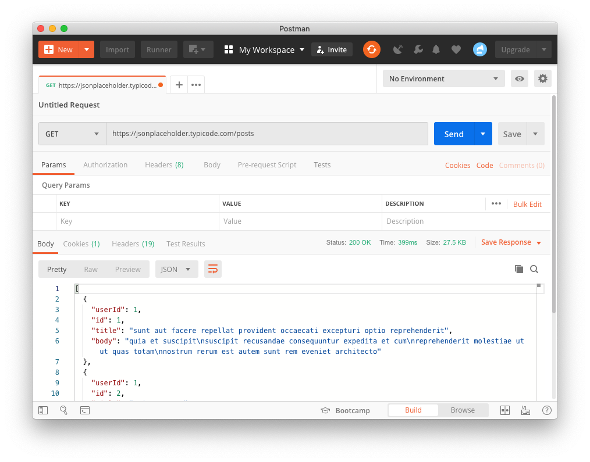
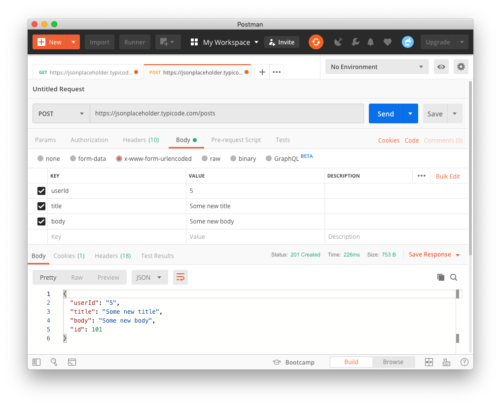
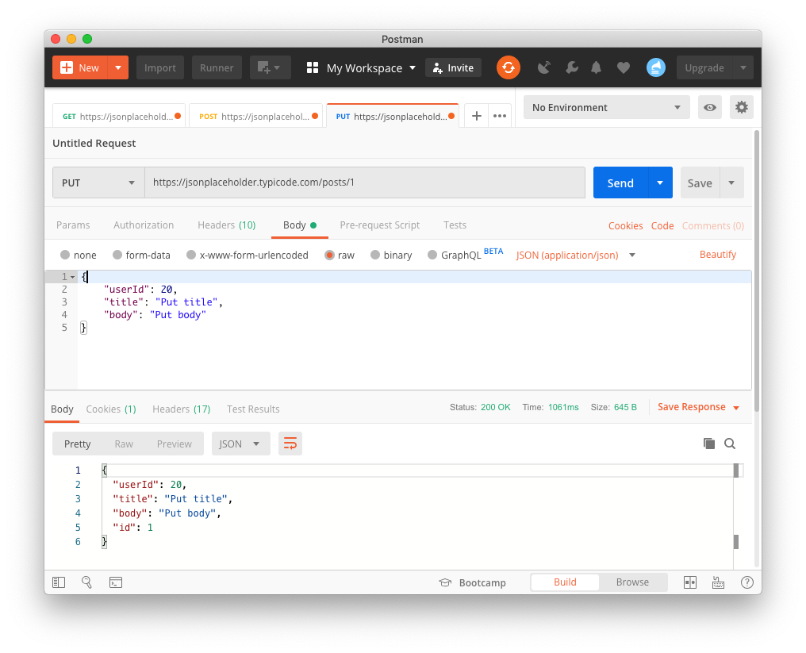
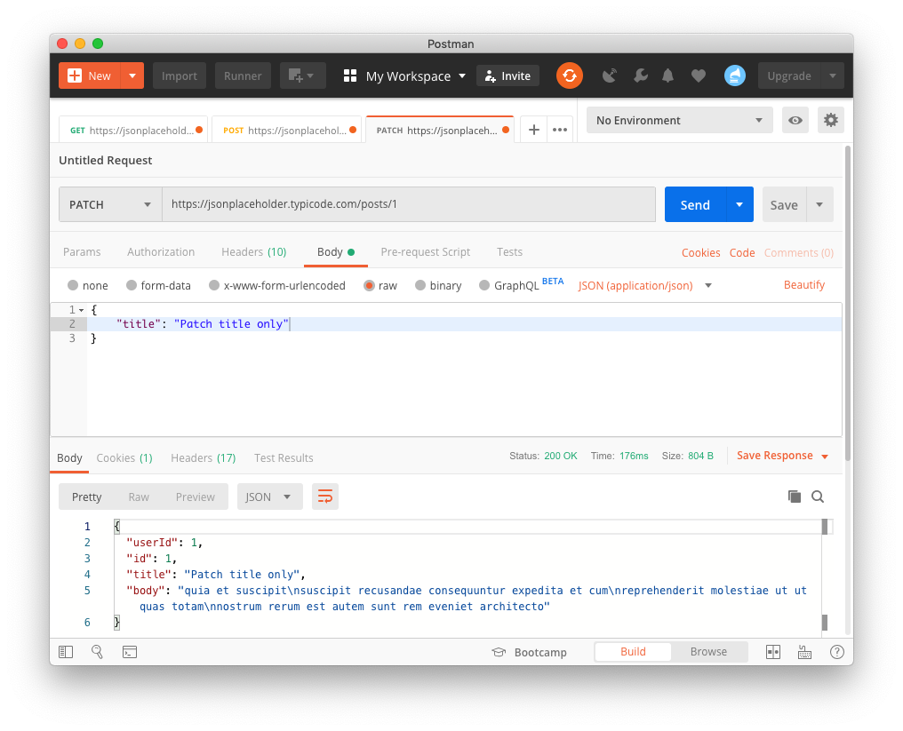
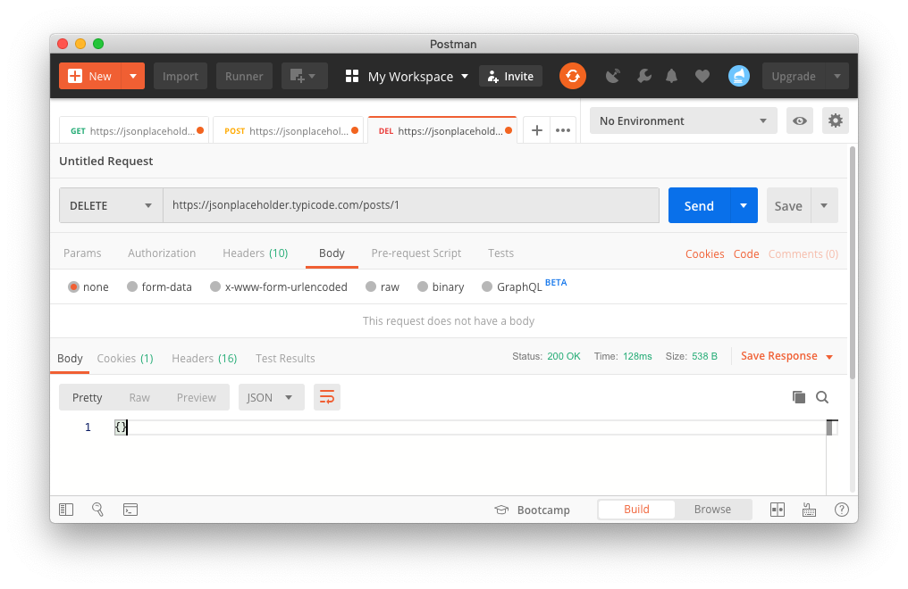
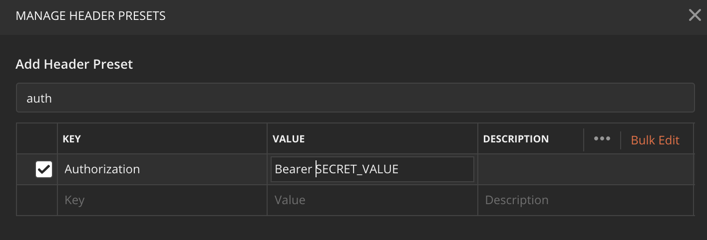

[Postman](https://www.getpostman.com/) is an API testing environment. [cURL](https://curl.haxx.se/) is a command line tool for transfering data via URLs. When it comes to REST APIs, we can use Postman as a GUI (graphical user interface) and cURL as a CLI (command line interface) to do the same tasks.

#### Prerequisites

If you don't yet understand REST or know how to use REST APIs, please read [Understanding REST and REST APIs](https://code.tutsplus.com/tutorials/code-your-first-api-with-nodejs-and-express-understanding-rest-apis--cms-31697).

### Goals

I'm going to demonstrate how to do `GET`, `POST`, `PUT`, `PATCH`, and `DELETE` requests via Postman and cURL. If you don't have Postman, simply download it from the [website](https://www.getpostman.com/). cURL should already be installed in your macOS or Linux environment.

### Endpoints

I'm going to use [JSON Placeholder](https://jsonplaceholder.typicode.com), an awesome example site for testing API calls. You can follow along and paste all the commands into your terminal to see what response you get.

Here is the map of methods to endpoints we'll be using. `/posts` means all, and the `1` in `/posts/1` represents `/posts/{id}`, so ID number`1`.

| Method   | Endpoint                                                                                       |
| -------- | ---------------------------------------------------------------------------------------------- |
| `GET`    | [`https://jsonplaceholder.typicode.com/posts`](https://jsonplaceholder.typicode.com/posts)     |
| `POST`   | [`https://jsonplaceholder.typicode.com/posts`](https://jsonplaceholder.typicode.com/posts)     |
| `PUT`    | [`https://jsonplaceholder.typicode.com/posts/1`](https://jsonplaceholder.typicode.com/posts/1) |
| `PATCH`  | [`https://jsonplaceholder.typicode.com/posts/1`](https://jsonplaceholder.typicode.com/posts/1) |
| `DELETE` | [`https://jsonplaceholder.typicode.com/posts/1`](https://jsonplaceholder.typicode.com/posts/1) |

You can click those URLs to see the GET values they provide to the browser. You can use the browser for GET, but you'll have to use cURL or Postman to POST, PUT, PATCH or DELETE.

### cURL CLI arguments

Here are a few cURL argument we'll pass with our requests. All requests will simply be `curl` followed by the argument and data to pass.

```bash
curl
```

- [`-X`, `--request`](https://curl.haxx.se/docs/manpage.html#-X) - Custom request method
- [`-d`, `--data`](https://curl.haxx.se/docs/manpage.html#-d) - Sends the specified data
- [`-H`, `--header`](https://curl.haxx.se/docs/manpage.html#-H) - Sends headers
- [`-i`, `--include`](https://curl.haxx.se/docs/manpage.html#-i) - Display response headers

## GET

GET retrieves data.

<div class="filename">GET Request</div>

```bash
curl https://jsonplaceholder.typicode.com/posts
```

> You can also use `curl -i` to get more information from the headers.

All you have to do for Postman is paste the URL, select GET, and send.



## POST

POST creates a new resource. It is **non-idempotent**, meaning that two identical POST requests will create two new resources.

<div class="filename">POST Request</div>

```bash
curl -X POST -d "userId=5&title=Stuff and Things&body=An amazing blog post about both stuff and things." https://jsonplaceholder.typicode.com/posts
```

<div class="filename">POST Request (json)</div>

```bash
curl -X POST -H "Content-Type: application/json" -d '{"userId": 5, "title": "Stuff and Things", "body": "An amazing blog post about both stuff and things."}' https://jsonplaceholder.typicode.com/posts
```

There are two ways to do this via Postman. After selecting POST, you can go to **Body**, select `x-www-form-urlencoded`, and type each individual value in. If you go to **Headers**, you'll see `Content-Type: application/x-www-form-urlencoded`.



Or you can go to Body, select raw, select `JSON`, and send the actual JSON you intend to send. If you go to **Headers**, you'll see `Content-Type: application/json`.


## PUT

PUT updates an existing resource. It is **idempotent**, meaning that two identical PUT requests will modify the same resource. A POST requires the entire body to be sent through; if any data is missing, that data will be wiped (except automatic values like auto-incrementing IDs and timestamps).

<div class="filename">PUT Request</div>

```bash
curl -X PUT -d "userId=1&title=Something else&body=A new body" https://jsonplaceholder.typicode.com/posts/1
```

<div class="filename">PUT Request (json)</div>

```bash
curl -X PUT -H "Content-Type: application/json" -d '{"userId": 1, "title": "Something else", "body": "A new body"}' https://jsonplaceholder.typicode.com/posts/1
```

Sending the values is the same as with POST.



## PATCH

PATCH updates an existing resource, and does not require sending the entire body with the request.

<div class="filename">PATCH Request</div>

```bash
curl -X PATCH -d "title='Only change the title'" https://jsonplaceholder.typicode.com/posts/1
```

<div class="filename">PATCH Request (json)</div>

```bash
curl -X PATCH -H "Content-Type: application/json" -d '{"title": "Only change the title"}' https://jsonplaceholder.typicode.com/posts/1
```

No change to sending the values.



## DELETE

DELETE removes a resource.

<div class="filename">DELETE Request</div>

```bash
curl -X DELETE https://jsonplaceholder.typicode.com/posts/1
```

No values to send.



## Authentication

If you need to send additional headers, like `Authorization: Bearer` or `x-jwt-assertion` for JWT-based authentication, you can do it through cURL like this.

```bash
curl \
  -H "Content-Type: application/json" \
  -H "Authorization: Bearer <JWT_TOKEN>" \
  -H "x-jwt-assertion: <JWT_TOKEN>" \
  -X POST \
  -d  '{"key1" : "value1", "key2" : "value2"}' \
  https://example.com/
```

In Postman, you'll go to **Headers** and add `Authorization` as the key and `Bearer <JWT_TOKEN>` as the value to send authentication values. You can also go to **Headers**, click Presets, Manage Presets, and put your own reusable variables in for any headers or values you'll be reusing a lot.



## Conclusion

This guide provides all the basics for getting started with testing your APIs, either through Postman's GUI or cURL's CLI, using JSON or urlencoded form data.
